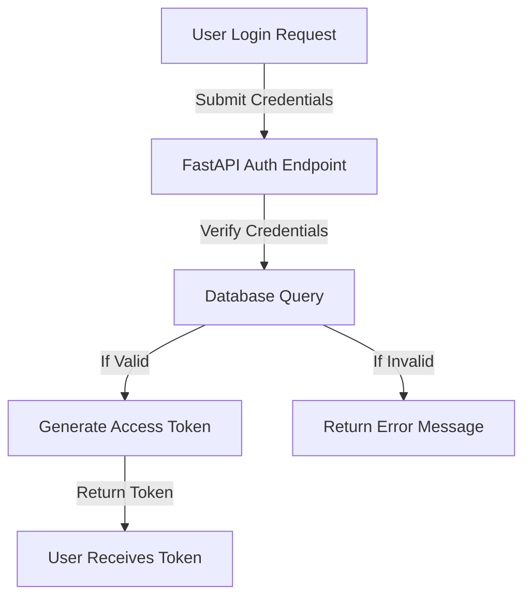
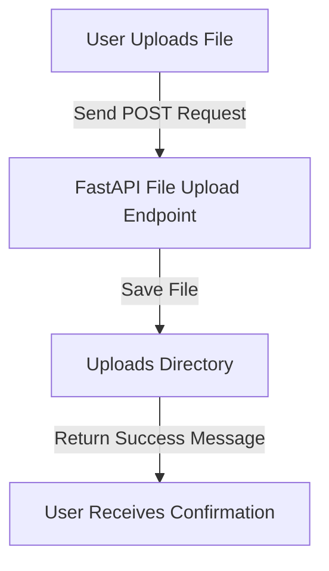
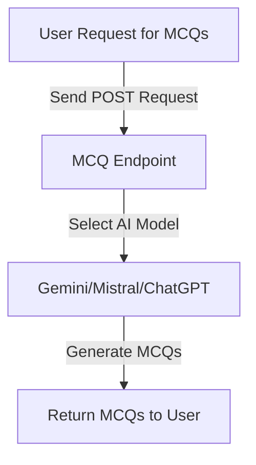
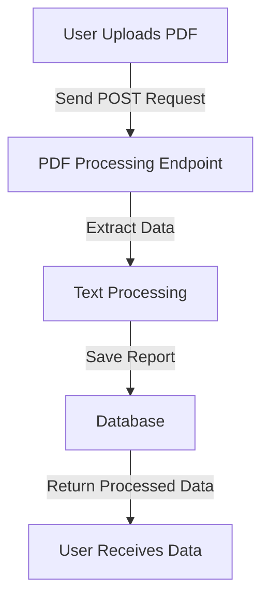

# Store the API documentation here# README

## Overview
This project is a FastAPI-based application that provides multiple endpoints for authentication, file uploads, MCQ generation, and PDF processing. Below is an overview of the key functionalities and their flowcharts.

---

## API Endpoints and Flowcharts

### 1. Authentication Process
Handles user authentication including password hashing, verification, and token creation.



### 2. File Upload Process
Handles file uploads and stores them in the `uploads` directory.



### 3. MCQ Generation
Generates multiple-choice questions using different AI models.



### 4. PDF Processing
Processes uploaded PDFs and extracts necessary information.



---

## Installation and Setup
1. Clone the repository:
   ```bash
   git clone https://github.com/your-repo.git
   ```
2. Navigate to the project directory:
   ```bash
   cd your-project
   ```
3. Install dependencies:
   ```bash
   pip install -r requirements.txt
   ```
4. Run the application:
   ```bash
   uvicorn app:app --reload
   ```

---


