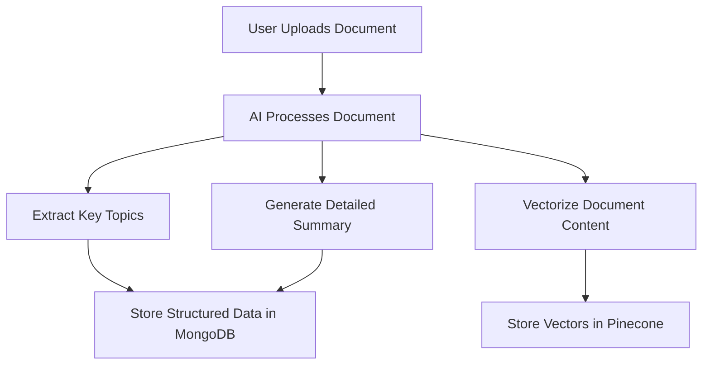
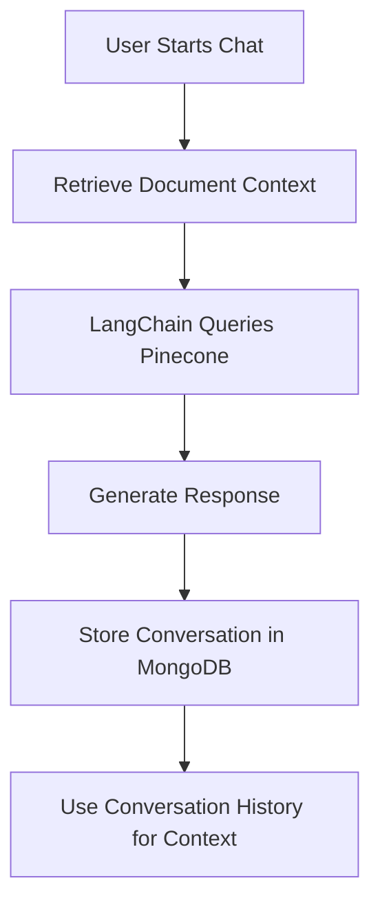
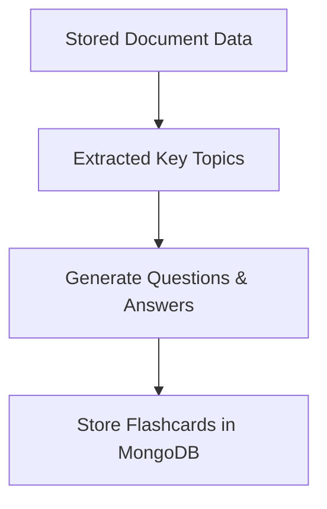
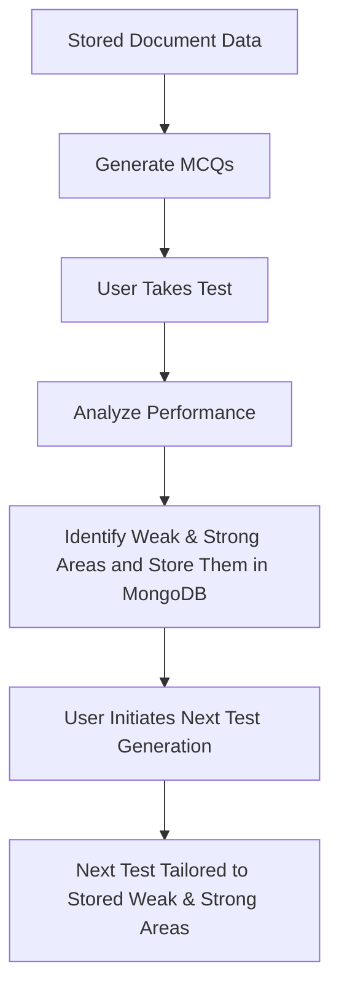

# NoteSight Generative AI Solution

## Overview
This project aims to build an AI-powered learning assistant using OpenAI's GPT-4o and GPT-4o-mini. The system will:
- **Process and store detailed STEM/Non-STEM documents**.
- **Enable AI-driven document chat** with strict contextual guardrails.
- **Store conversation history** and use it as context for future interactions.
- **Leverage LangChain for enhanced document querying and conversation memory**.
- **Use MongoDB/Pinecone for efficient document storage and retrieval**.
- **Generate flashcards** with topics, questions, and concise answers.
- **Generate MCQs** to create interactive tests.
- **Analyze user test performance**, identifying strong and weak areas and storing them.
- **Allow users to initiate test generation**, tailoring the next test based on stored proficiency data.

---

## System Architecture

### **1. Document Processing & Storage**
- **User uploads a document**.
- **AI processes the document** to generate structured details.
- **Vectorizes document content using Pinecone for efficient search**.
- **Stores structured data in MongoDB/Pinecone**.

### **2. AI Chat with Documents**
- Users can chat with AI to query stored documents.
- AI ensures responses remain within document context.
- Implement guardrails for security and relevance.
- **Conversations are stored** to maintain context across sessions.
- **LangChain manages conversation memory and document retrieval from Pinecone**.

### **3. Flashcard Generation**
- Extract key topics from the document.
- Generate **questions, crisp answers, and topics**.
- Store flashcards in MongoDB for retrieval.

### **4. MCQ Test Generation**
- Extract learning objectives from the document.
- Generate **multiple-choice questions (MCQs)**.
- Store tests in a structured format.

### **5. Adaptive Learning Based on Test Results**
- Users take AI-generated tests.
- System analyzes performance (weak & strong areas) and **stores this data in MongoDB**.
- Users can initiate test generation.
- **Future tests are tailored based on stored weak and strong areas**.

---

## **Tech Stack**
### **Backend:**
- **FastAPI** (Python) for API development.
- **OpenAI GPT-4o & GPT-4o-mini** for text generation.
- **LangChain** for managing document querying and chat memory.
- **MongoDB/Pinecone** for document and test storage.
- **Redis** for caching frequently accessed data.
- **Celery** for background processing (async tasks).

### **Infrastructure:**
- **Docker** for containerized deployment.
- **Kubernetes** for scalability.
- **AWS/GCP/Azure** for cloud storage and computing.

---

## **Flowcharts**

### **Document Processing & Storage**

### **AI Chat with Documents & Conversation Storage**

### **Flashcard Generation**

### **MCQ Test Generation & Adaptive Learning**

---

## **APIs Endpoints**

### **1. Document Management**
- `POST /upload-document-to-ai` – Uploads and processes a document.
- `GET /documents/{id}` – Retrieves stored document details. (Digital Side)

### **2. AI Chat with Documents**
- `POST /chat` – Chat with AI about a document.
- `GET /chat-history/{user_id}` – Retrieves stored conversation history. (Digital Side)

### **3. Flashcard Generation**
- `POST /create-flashcards/{document_id}` – Generate flash cards for a document
- `GET /flashcards/{document_id}` – Retrieves flashcards for a document.
(Digital Side)

### **4. MCQ Test Management**
- `GET /generate-test/{document_id}` – Generates an MCQ test.
- `POST /submit-test` – Submits test answers. (Digital Side)
- `GET /test-results/{user_id}` – Retrieves test results. (Digital Side)

### **5. Adaptive Learning**
- `POST /store-performance/{user_id}` – Stores weak and strong areas in MongoDB.
- `GET /adaptive-test/{user_id}` – User initiates next test, tailored based on stored performance.

---

## **Security & Guardrails**
- **Data Protection**: Store all documents securely using encryption.
- **Chat Context Guardrails**: AI responses must be restricted to document contents.
- **Conversation Storage**: Only the user's previous interactions are used as context.
- **Rate Limiting**: Prevent API abuse.
- **Role-Based Access**: Restrict certain functionalities based on user roles.

---

## **Deployment Strategy**
1. **Development & Local Testing**:
   - Use Docker for local testing.
   - Integrate OpenAI API keys securely.
2. **Staging Deployment**:
   - Deploy on AWS/GCP/Azure.
   - Use Kubernetes for autoscaling.
3. **Production Deployment**:
   - Implement CI/CD with GitHub Actions.
   - Use monitoring tools (Prometheus, Grafana).

---

---

This documentation provides a comprehensive plan for implementing the Generative AI-powered learning assistant with **LangChain-powered document chat**, **conversation memory storage**, and **efficient vectorized document retrieval using Pinecone**.
